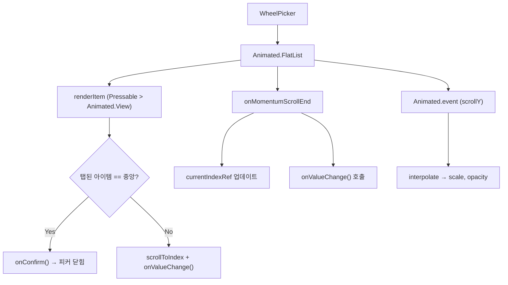

iOS 네이티브 UIPickerView와 유사한 커스텀 휠 피커 컴포넌트. `Animated.FlatList` 기반으로 스크롤 시 중앙 아이템이 강조되는 피커를 구현.

---

### 1. 개요

| 항목 | 내용 |
| --- | --- |
| 파일 위치 | src/components/common/WheelPicker.tsx |
| 핵심 기술 | Animated.FlatList, Animated.event, interpolate, Pressable |
| 사용처 | AddWorkRequestModal, WorkerCorrectionRequestModal |

---

### 2. Props

| Prop | 타입 | 기본값 | 설명 |
| --- | --- | --- | --- |
| items | WheelPickerItem[] | 필수 | { label, value } 배열 |
| selectedValue | string \| number | 필수 | 현재 선택된 값 (외부 상태와 동기화) |
| onValueChange | (value) => void | 필수 | 스크롤/탭으로 값 변경 시 호출 |
| onConfirm | () => void | undefined | 중앙 아이템 탭 시 호출 (피커 닫기 등) |
| itemHeight | number | 40 | 각 아이템 높이 (px) |
| visibleCount | number | 3 | 동시에 보이는 아이템 수 (홀수 권장) |
| width | number | 80 | 피커 너비 (px) |

---

### 3. 핵심 동작 원리

#### 3-1. 스크롤 애니메이션 (Animated.event + interpolate)

```typescript
// scrollY를 Animated.event로 네이티브 드라이버에서 직접 추적
onScroll={Animated.event(
  [{ nativeEvent: { contentOffset: { y: scrollY } } }],
  { useNativeDriver: true }
)}
```

각 아이템은 `scrollY`를 기준으로 자신의 위치에 따라 `scale`과 `opacity`를 interpolate합니다.

```typescript
const scale = scrollY.interpolate({
  inputRange: [(i-2)*h, (i-1)*h, i*h, (i+1)*h, (i+2)*h],
  outputRange: [0.7, 0.85, 1, 0.85, 0.7],  // 중앙일수록 크게
  extrapolate: "clamp",
});
```

> **웹 React 비교**: 웹에서는 CSS `transform: scale()` + JS scroll event로 구현하지만, RN에서는 `useNativeDriver: true`로 **JS 스레드 부하 없이** 네이티브에서 애니메이션 처리

#### 3-2. 스냅 스크롤 (snapToInterval)

```typescript
snapToInterval={itemHeight}   // 40px 단위로 스냅
decelerationRate="fast"        // 빠르게 감속
```

> **웹 비교**: CSS `scroll-snap-type: y mandatory` + `scroll-snap-align: center`와 동일한 효과

#### 3-3. 아이템 탭 처리 (handleItemPress)

| 사용자 액션 | 동작 |
| --- | --- |
| 중앙(선택된) 아이템 탭 | onConfirm() 호출 → 피커 닫힘 |
| 비중앙 아이템 탭 | 해당 아이템으로 스크롤 이동 + onValueChange() 호출 |
| 스크롤 후 멈춤 | onMomentumScrollEnd → onValueChange() 호출 |

`currentIndexRef`로 현재 중앙 아이템 인덱스를 추적하여 탭된 아이템이 중앙인지 판별합니다.

#### 3-4. 초기값 동기화 (마운트 시 useEffect)

```typescript
useEffect(() => {
  const index = items.findIndex((item) => item.value === selectedValue);
  const initialValue = index >= 0 ? items[index].value : items[0]?.value;
  if (initialValue !== undefined) {
    onValueChange(initialValue);
  }
}, []);
```

> **왜 필요한가?** `onMomentumScrollEnd`는 스크롤이 발생해야만 호출됩니다. 아이템이 1개뿐이거나 이미 선택된 값에서 변경하지 않는 경우 스크롤이 없어 부모 컴포넌트에 값이 전달되지 않는 버그가 있었습니다.

---

### 4. 사용 예시

```typescript
// 기본 사용
<WheelPicker
  items={[{ label: "09", value: 9 }, { label: "10", value: 10 }]}
  selectedValue={9}
  onValueChange={(v) => setHour(v as number)}
/>

// 탭으로 닫기 기능 포함
<WheelPicker
  items={pickerConfig.items}
  selectedValue={pickerConfig.selectedValue}
  onValueChange={handlePickerChange}
  onConfirm={() => togglePicker(activePicker)}  // 피커 닫기
  width={pickerConfig.width}
/>
```

---

### 5. 구조 다이어그램



---

### 6. 주의사항

> ⚠️ **VirtualizedList 중첩 경고**: ScrollView 내부에서 WheelPicker를 사용하면 경고가 발생합니다. Modal이나 BottomSheetModal 내부에서는 문제 없습니다.

> 💡 **useNativeDriver 제약**: `transform`과 `opacity`만 네이티브 드라이버로 애니메이션 가능합니다. `backgroundColor`, `width`, `height` 등은 불가합니다.

---

### 7. 관련 상수 (pickerItems.ts)

| 상수 | 설명 | 값 범위 |
| --- | --- | --- |
| HOUR_ITEMS | 시간 선택 | 0~23 |
| MINUTE_ITEMS | 분 선택 (10분 단위) | 0, 10, 20, 30, 40, 50 |
| BREAK_ITEMS | 휴게 시간 (분) | 0, 10, 20, 30, 40, 50, 60 |
| getDateItems() | 이번 달 날짜 | 1~28/29/30/31 |
